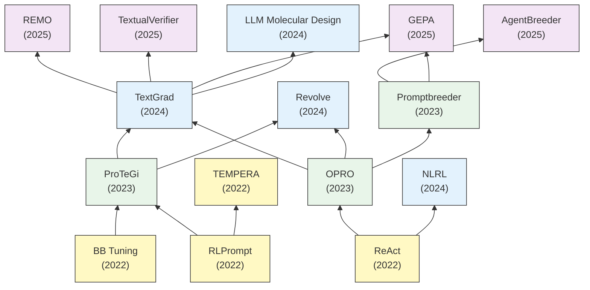

# LLMと逐次改善 要約

## 要約

本テーマ「LLMと逐次改善」では、大規模言語モデル (LLM) に対するプロンプティング手法の最適化と、LLM自体の推論能力を用いた自律的な自己改善・メタ最適化に関する一連の研究系譜をまとめています。

初期の研究（2022年頃）は、離散的なプロンプト（テキスト）を外部の強化学習モジュールや勾配フリーアルゴリズム（RLPrompt、BB Tuning）を用いて最適化するアプローチが主流でした。同時に、ReAct のようにLLMに行動と思考プロセスを組み込ませる手法が登場し、言語モデル自身の推論・反省能力が注目されました。

その後（2023年頃）、外部オプティマイザに頼らず、LLM自身を自然言語によるオプティマイザとして活用するパラダイムシフト（OPRO）が起きました。ProTeGi や Promptbreeder などの研究では、テキストを通じた「擬似的な勾配（Textual Gradients）」や「進化的アルゴリズム」により、プロンプトをLLM自身に反復的に改善させることが可能となりました。

現在（2024〜2025年）では、TextGrad に代表されるように、自然言語によるテキスト勾配を用いたシステム全体の最適化が確立し、RAGの実装からコード生成、分散システムの最適化にまで応用範囲が拡大しています。さらに、生成された最適化プロセスに対する自己検証（TextualVerifier、GEPA）や長期的な記憶を用いたメタ最適化（REMO）、マルチエージェント環境下での進化的改善（AgentBreeder）など、より高度かつ複雑なシステムへと最適化の概念が拡張されています。

## 年表

| 論文名 | 提案モデル | 発表年 | 発表場所 | 概要 | リンク |
| :--- | :---: | :---: | :---: | :--- | :--- |
| Black box tuning for language model as a service | Black-Box Tuning (BBT) | 2022 | arXiv | API経由のLLM（勾配アクセス不可）に対し、タスクの実効的な「内在的次元」の小ささに着目。固定のランダム投影行列を利用して数万次元の連続値プロンプト探索空間を数百次元へ圧縮し、そこに勾配フリー最適化（CMA-ES）を適用することで、少数データ環境下でも従来のフルパラメータ更新を凌駕する精度を実証した手法。 | [詳細](<./article_summaries/Black box tuning for language model as a service/summary.md>) |
| RLPROMPT: OPTIMIZING DISCRETE TEXT PROMPTS WITH REINFORCEMENT LEARNING | RLPrompt | 2022 | arXiv | LLMの勾配を必要とせず、AIの自動評価や実際の分類精度を報酬シグナルとして強化学習を行い、最適な離散プロンプトを生成する手法。 | [詳細](<./article_summaries/RLPROMPT: OPTIMIZING DISCRETE TEXT PROMPTS WITH REINFORCEMENT LEARNING/summary.md>) |
| REACT: SYNERGIZING REASONING AND ACTING IN LANGUAGE MODELS | ReAct | 2022 | ICLR 2023 | 言語モデル内で思考（Reasoning）と行動（Acting）を連携させ、情報収集と文脈推論を統合する汎用的な推論手法。 | [詳細](<./article_summaries/REACT: SYNERGIZING REASONING AND ACTING IN LANGUAGE MODELS/summary.md>) |
| TEMPERA: TEST-TIME PROMPT EDITING VIA REINFORCEMENT LEARNING | TEMPERA | 2022 | ICLR 2023 | 強化学習を用いて、テストケースごとに柔軟にプロンプト（命令表現や例の順序）を動的に編集・最適化する手法。 | [詳細](<./article_summaries/TEMPERA: TEST-TIME PROMPT EDITING VIA REINFORCEMENT LEARNING/summary.md>) |
| Automatic Prompt Optimization with “Gradient Descent” and Beam Search | ProTeGi | 2023 | arXiv | 自然言語によるテキスト勾配を用いた勾配降下法とビーム探索を組み合わせ、方向性を持ったプロンプト最適化を行う手法。また、バンディットアルゴリズムを用いて有望な候補に評価を集中させ推論検証コスト（API予算）を削減する工夫も盛り込まれている。後のTextGradなどへ繋がるText-Gradient（テキスト勾配）系最適化アルゴリズムの始祖的な位置づけ。 | [詳細](<./article_summaries/Automatic Prompt Optimization with “Gradient Descent” and Beam Search/summary.md>) |
| Large Language Models as Optimizers | OPRO | 2023 | arXiv | LLMを汎用的なブラックボックス最適化器として活用するフレームワーク。明示的なエラー分析に頼る局所的な探索（ProTeGiなど）とは異なり、メタプロンプト内に複数のプロンプト履歴とそのスコア上昇軌跡を並べて俯瞰させることで、コンテキスト内学習によって大局的な改善方向（暗黙の勾配）を推論させるアプローチをとる。 | [詳細](<./article_summaries/LARGE LANGUAGE MODELS AS OPTIMIZERS/summary.md>) |
| Promptbreeder: Self-Referential Self-Improvement Via Prompt Evolution | Promptbreeder | 2023 | arXiv | プロンプト自体だけでなく「プロンプトを変異させるプロンプト」も自己参照的に進化させ、ドメイン適応と継続的改善を実現。 | [詳細](<./article_summaries/Promptbreeder: Self-Referential Self-Improvement Via Prompt Evolution/summary.md>) |
| Large Language Models as Molecular Design Engines | Molecular Design LLMs | 2024 | Nature | LLMを用いて、複雑な追加学習なしに自然言語プロンプトで分子設計（構造生成・最適化）を行うアプローチ。 | [詳細](<./article_summaries/Large Language Models as Molecular Design Engines/summary.md>) |
| TextGrad: Automatic "Differentiation" via Text | TextGrad | 2024 | arXiv | LLMシステムの計算グラフ全体に対し、自然言語フィードバックをテキスト勾配として逆伝播させる汎用最適化フレームワーク。ProTeGiが単一のプロンプト最適化であったのに対し、本作は「連鎖律（多段コンポーネントへの逆伝播）」や「モメンタム・バッチ処理等」を導入。これによりプロンプト改善に限らず、コード生成（LeetCode手法）、分子構造の設計、放射線治療計画のハイパーパラメータ最適化など、全く異なるドメインの推論・設計問題へ単一のフレームワークで適用可能とした点が最大の差異。 | [詳細](<./article_summaries/TextGrad: Automatic "Differentiation" via Text/summary.md>) |
| NATURAL LANGUAGE REINFORCEMENT LEARNING | NLRL / RAGEN | 2024 | arXiv | エージェントがスカラー報酬だけでなく「理由」を推論しながら能動的かつ熟考的に学習する、自然言語ベースの強化学習。 | [詳細](<./article_summaries/NATURAL LANGUAGE REINFORCEMENT LEARNING/summary.md>) |
| Revolve: Optimizing AI Systems by Tracking Response Evolution in Textual Optimization | Revolve | 2024 | arXiv | 一階微分的なテキスト勾配（TextGrad等）の局所解停滞を防ぐため、応答の進化履歴を追跡・評価し最適化を導く手法。 | [詳細](<./article_summaries/Revolve: Optimizing AI Systems by Tracking Response Evolution in Textual Optimization/summary.md>) |
| AgentBreeder: Mitigating the AI Safety Risks of Multi-Agent Scaffolds via Self-Improvement | AgentBreeder | 2025 | arXiv | マルチエージェント環境（スキャフォールド）特有の安全性と性能のトレードオフを、自動的・進化的に最適化するフレームワーク。 | [詳細](<./article_summaries/AgentBreeder: Mitigating the AI Safety Risks of Multi-Agent Scaffolds via Self-Improvement/summary.md>) |
| TextualVerifier: Verify TextGrad Step-by-Step | TextualVerifier | 2025 | arXiv | TextGradの多段階推論や最適化サイクルにおける中間ステップの正しさをLLM自身が自己検証（Self-verification）する仕組み。 | [詳細](<./article_summaries/TextualVerifier: Verify TextGrad Step-by-Step/summary.md>) |
| GEPA: REFLECTIVE PROMPT EVOLUTION CAN OUTPERFORM REINFORCEMENT LEARNING | GEPA | 2025 | arXiv | RLベースのテスト時計算の課題（サンプル効率や報酬のスパース性）を解決するため、進化的探索とパレート最適を利用した手法。 | [詳細](<./article_summaries/GEPA: REFLECTIVE PROMPT EVOLUTION CAN OUTPERFORM REINFORCEMENT LEARNING/summary.md>) |
| Reflection-Enhanced Meta-Optimization: Integrating TextGrad-style Prompt Optimization with Memory-Driven Self-Evolution | REMO | 2025 | arXiv | テキスト勾配最適化に過去の経験やメモリを統合し、タスク間での最適化戦略の再利用や過学習の防止を図るメタ最適化手法。 | [詳細](<./article_summaries/Reflection-Enhanced Meta-Optimization: Integrating TextGrad-style Prompt Optimization with Memory-Driven Self-Evolution/summary.md>) |

## 引用関係

以下のグラフは、LLMのプロンプティングと逐次改善における主要な論文の引用・影響関係（有向非巡回グラフ）を示しています。古い研究が下に、新しい研究が上に配置されています。

## 研究の相互関係

1.  **段階的最適化とブラックボックスAPIへの適応**
    `BB Tuning` や `RLPrompt` が切り開いた「LLMの実体を触らずに（＝勾配フリーで）外部からの入力のみで最適化する」というコンセプトは、`TEMPERA` などを経て、外部の学習モデル（RL）ではなく「LLM自身の自然言語推論能力」を活用するパラダイム（`OPRO`, `ProTeGi`）へと引き継がれました。

2.  **自己進化とメタプロンプティング（Evolutionary Algorithms）**
    プロンプトを単に進化的探索（遺伝的アルゴリズム）で最適化するだけでなく、突然変異を起こすためのプロンプト自体もLLMに改良させるメタ最適化のアプローチは `Promptbreeder` などで花見開き、これがマルチエージェントスキャフォールドの進化系である `AgentBreeder` や自己内省メカニズムを組み込んだ `GEPA` に直結しています。

3.  **テキスト最適化機能（Textual Gradients）とシステム検証**
    `ProTeGi` のTextual Gradientの着想は、2024年に至りPyTorchなどと同様のAutomatic Differentiation（自動微分）としてフレームワーク化した `TextGrad` へと極まりました。ここから派生し、一時的な局所解を避けるための履歴・記憶を用いたメタ最適化 `REMO` や `Revolve` 、複雑なドメインやマルチステップ推論におけるハルシネーションを防ぐ工程監視アルゴリズム `TextualVerifier` など、最適化手法の「安定性・頑健性・検証可能性」を担保するより強固なフレームワークの研究へと発展しています。

4.  **強化学習との融合と発展（RL & Reasoning）**
    一方で、`ReAct` のように思考プロセスと行動をインタラクティブに回す能力は、単純なReward（報酬）に基づく強化学習（RLPrompt等）の課題を克服するアプローチとして、自然言語でスカラー報酬だけでなく「理由」も追記させる `NLRL` のような新しい強化学習フレームワークを生み出しました。
