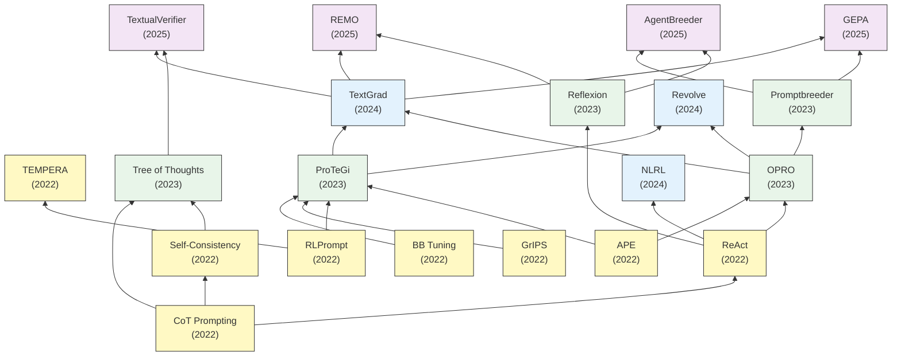

# LLMと逐次改善 要約

## 要約

本テーマ「LLMと逐次改善」では、大規模言語モデル (LLM) に対するプロンプティング手法の最適化と、LLM自体の推論能力を用いた自律的な自己改善・メタ最適化に関する一連の研究系譜をまとめています。

初期の研究（2022年頃）は、離散的なプロンプトを外部の強化学習モジュールや勾配フリーアルゴリズム（RLPrompt、BB Tuning、GrIPS）を用いて最適化するアプローチと、LLMに内在する推論能力を引き出すアプローチ（CoT、Self-Consistency、APE）が主流でした。同時に、ReActのように思考プロセスと行動を統合する手法も登場し、言語モデルの自律的活用が模索され始めました。

その後（2023年頃）は、外部の最適化器に頼らず、LLM自身を自然言語によるオプティマイザとして活用するパラダイムシフト（OPRO、ProTeGi）が起きました。さらに、CoTやReActを基盤とした高度な推論探索（ToT）やテキスト自己反省（Reflexion）、プロンプトの進化的探索（Promptbreeder）など、自己参照的な改善モデルが多数登場しました。

現在（2024〜2025年）では、TextGradに代表されるようにシステム全体の計算グラフをテキスト勾配として逆伝播させる汎用的な最適化フレームワークが確立し、RAGやマルチエージェントシステムの最適化にも応用されています。生成されたプロンプトや推論プロセスの自己検証（TextualVerifier、GEPA）や長期記憶によるメタタスク最適化（REMO）、社会的な最適化（AgentBreeder）など、より複雑な環境下での進化と頑健性の担保に主眼が置かれています。

## 年表

| 論文名 | 提案モデル | 発表年 | 発表場所 | 概要 | リンク |
| :--- | :---: | :---: | :---: | :--- | :--- |
| Chain-of-Thought Prompting Elicits Reasoning in Large Language Models | CoT | 2022 | NeurIPS 2022 | プロンプトに推論プロセス（思考の連鎖）を含めることで、LLMの複雑な推論能力（算術、常識、記号推論）を大幅に向上させる画期的な手法。 | [詳細](<./article_summaries/Chain-of-Thought Prompting Elicits Reasoning in Large Language Models/summary.md>) |
| Self-Consistency Improves Chain of Thought Reasoning in Language Models | Self-Consistency | 2022 | ICLR 2023 | CoTを用いて複数の多様な推論パスをサンプリングし、最も一貫性のある答えを多数決で選ぶことで、推論の精度と堅牢性をより向上させる手法。 | [詳細](<./article_summaries/Self-Consistency Improves Chain of Thought Reasoning in Language Models/summary.md>) |
| Black box tuning for language model as a service | Black-Box Tuning (BBT) | 2022 | arXiv | API経由のLLM（勾配アクセス不可）に対し、ランダム投影行列を利用して探索空間を圧縮し、勾配フリー最適化（CMA-ES）を適用する手法。 | [詳細](<./article_summaries/Black box tuning for language model as a service/summary.md>) |
| RLPROMPT: OPTIMIZING DISCRETE TEXT PROMPTS WITH REINFORCEMENT LEARNING | RLPrompt | 2022 | ACL 2022 | LLMの勾配を必要とせず、強化学習を用いて探索を行い最適な離散プロンプトを生成する手法。 | [詳細](<./article_summaries/RLPROMPT: OPTIMIZING DISCRETE TEXT PROMPTS WITH REINFORCEMENT LEARNING/summary.md>) |
| GrIPS: Gradient-free, Edit-based Instruction Search for Prompting Large Language Models | GrIPS | 2022 | EACL 2023 | 勾配を使わず、削除や入れ替えなどの単純なテキスト編集操作を繰り返すことで、段階的に指示（インストラクション）を探索する手法。 | [詳細](<./article_summaries/GrIPS: Gradient-free, Edit-based Instruction Search for Prompting Large Language Models/summary.md>) |
| Large Language Models Are Human-Level Prompt Engineers | APE | 2022 | ICLR 2023 | プロンプトそのものをLLMにプログラムとして自動生成させ、スコアリングを通じて最適なプロンプトを自動探索・選択させるフレームワーク。 | [詳細](<./article_summaries/Large Language Models Are Human-Level Prompt Engineers/summary.md>) |
| REACT: SYNERGIZING REASONING AND ACTING IN LANGUAGE MODELS | ReAct | 2022 | ICLR 2023 | 言語モデル内で思考（Reasoning）と環境からの行動（Acting）を連携させ、情報収集と文脈推論を統合する汎用的な手法。 | [詳細](<./article_summaries/REACT: SYNERGIZING REASONING AND ACTING IN LANGUAGE MODELS/summary.md>) |
| TEMPERA: TEST-TIME PROMPT EDITING VIA REINFORCEMENT LEARNING | TEMPERA | 2022 | ICLR 2023 | 強化学習を用いて、テストケース（クエリ）ごとに柔軟にプロンプトを動的に編集・最適化する手法。 | [詳細](<./article_summaries/TEMPERA: TEST-TIME PROMPT EDITING VIA REINFORCEMENT LEARNING/summary.md>) |
| Tree of Thoughts: Deliberate Problem Solving with Large Language Models | ToT | 2023 | NeurIPS 2023 | 推論過程を木の構造として探索し、LLM自身に有望な思考経路を評価させながら必要に応じてバックトラックを行うことで高度な問題解決を実現する手法。 | [詳細](<./article_summaries/Tree of Thoughts: Deliberate Problem Solving with Large Language Models/summary.md>) |
| Reflexion: Language Agents with Verbal Reinforcement Learning | Reflexion | 2023 | NeurIPS 2023 | エージェントが行動結果を自己評価し、テキストによる言語的フィードバック（内省）を記憶として蓄積することで反復的に推論能力を改善する。 | [詳細](<./article_summaries/Reflexion: Language Agents with Verbal Reinforcement Learning/summary.md>) |
| Automatic Prompt Optimization with “Gradient Descent” and Beam Search | ProTeGi | 2023 | EMNLP 2023 | 自然言語によるテキスト勾配を用いた勾配降下法とビーム探索を組み合わせ、方向性を持ったプロンプト最適化を行う手法。 | [詳細](<./article_summaries/Automatic Prompt Optimization with “Gradient Descent” and Beam Search/summary.md>) |
| Large Language Models as Optimizers | OPRO | 2023 | arXiv | メタプロンプト内に複数のプロンプト履歴とそのスコア上昇軌跡を俯瞰させることで、LLMを自然言語の汎用的オプティマイザとして活用する枠組み。 | [詳細](<./article_summaries/Large Language Models as Optimizers/summary.md>) |
| Promptbreeder: Self-Referential Self-Improvement Via Prompt Evolution | Promptbreeder | 2023 | arXiv | プロンプトを変異・進化させるための「突然変異プロンプト」自身もLLMに進化させることで、ドメイン適応と継続的な自己改善を実現する。 | [詳細](<./article_summaries/Promptbreeder: Self-Referential Self-Improvement Via Prompt Evolution/summary.md>) |
| TextGrad: Automatic "Differentiation" via Text | TextGrad | 2024 | arXiv | LLMシステムの計算グラフ全体に対し、自然言語フィードバックをテキスト勾配として逆伝播させる汎用的な最適化フレームワーク。 | [詳細](<./article_summaries/TextGrad: Automatic "Differentiation" via Text/summary.md>) |
| NATURAL LANGUAGE REINFORCEMENT LEARNING | NLRL | 2024 | arXiv | スカラー報酬だけでなく「なぜその行動の評価が高いのか」という理由をLLMに言語化させ能動的に学習させる強化学習手法。 | [詳細](<./article_summaries/NATURAL LANGUAGE REINFORCEMENT LEARNING/summary.md>) |
| Revolve: Optimizing AI Systems by Tracking Response Evolution in Textual Optimization | Revolve | 2024 | arXiv | 局所最適解からの停滞を防ぐため、最適化プロセスにおける応答の進化履歴を追跡・評価しよりグローバルな最適化を導く手法。 | [詳細](<./article_summaries/Revolve: Optimizing AI Systems by Tracking Response Evolution in Textual Optimization/summary.md>) |
| AgentBreeder: Mitigating the AI Safety Risks of Multi-Agent Scaffolds via Self-Improvement | AgentBreeder | 2025 | arXiv | マルチエージェント環境（スキャフォールド）特有の安全性と性能のトレードオフを、自動的・進化的に最適化するフレームワーク。 | [詳細](<./article_summaries/AgentBreeder: Mitigating the AI Safety Risks of Multi-Agent Scaffolds via Self-Improvement/summary.md>) |
| TextualVerifier: Verify TextGrad Step-by-Step | TextualVerifier | 2025 | arXiv | TextGradが生成する中間ステップやフィードバックに対し、LLM自身が自己検証することで誤った推論の連鎖を防ぐ仕組み。 | [詳細](<./article_summaries/TextualVerifier: Verify TextGrad Step-by-Step/summary.md>) |
| GEPA: REFLECTIVE PROMPT EVOLUTION CAN OUTPERFORM REINFORCEMENT LEARNING | GEPA | 2025 | arXiv | 推論時の計算において強化学習アルゴリズムに頼らず、進化的探索とパレート最適を利用してプロンプト進化能力を最大化する手法。 | [詳細](<./article_summaries/GEPA: REFLECTIVE PROMPT EVOLUTION CAN OUTPERFORM REINFORCEMENT LEARNING/summary.md>) |
| Reflection-Enhanced Meta-Optimization: Integrating TextGrad-style Prompt Optimization with Memory-Driven Self-Evolution | REMO | 2025 | arXiv | テキストベースの勾配最適化に過去の経験やメモリを統合し、タスク間での最適化戦略の再利用や過学習の防止を図るメタ最適化手法。 | [詳細](<./article_summaries/Reflection-Enhanced Meta-Optimization: Integrating TextGrad-style Prompt Optimization with Memory-Driven Self-Evolution/summary.md>) |

## 引用関係

以下のグラフは、LLMのプロンプティングと逐次改善における主要な20本の論文の引用・影響関係（有向非巡回グラフ）を示しています。古い研究が下に、新しい研究が上に配置されています。

## 研究の相互関係

1.  **プロンプティングの高度化と初期の自動探索 (Reasoning & Edit-based)**
    `CoT` (Chain-of-Thought) の登場により、LLMに推論過程を「思考の連鎖」として書き出させることが劇的な性能向上をもたらすことが証明されました。これにより `Self-Consistency`（多様な思考のサンプリング）や `ToT`（探索木のバックトラック）といった高度な推論アルゴリズムが派生しました。同時に `GrIPS`、`BB Tuning` などの勾配フリーな自動探索や、`APE` のようにLLM自身に最初のプロンプトを生成させる研究を通して、「いかにして最適な入力文を探索するか」が主要なテーマとなりました。
    
2.  **自己反省と相互作用を用いた改善 (Reflection & Action)**
    LLMを単発の出力器ではなく動的なエージェントとして捉える `ReAct` の行動と思考の連携は、自己のミスを「内省（リフレクション）」して次回のタスクに生かす `Reflexion` などの自己改善フレームワークへと進化しました。失敗体験を記録し言語化するアプローチは、後の `NLRL` のようにスカラー報酬以外の「理由付きの」強化学習という新境地を開拓しています。

3.  **自己オプティマイザと擬似勾配の確率 (Textual Gradients as Optimization)**
    外部でのスコアスキャンに頼らず、モデル自身に進化の方向性を模索させるメタ最適化が `OPRO` や `ProTeGi` により確立されました。特に `ProTeGi` が示した「自然言語によるエラーフィードバックを勾配情報に見立てる」着想は、後に `TextGrad` という形でPyTorchのような包括的な自動微分フレームワークへと昇華されました。この体系化により、単なるプロンプトチューニングを超えて、プログラムやグラフのような巨大なシステム全体に対する最適化が可能となりました。

4.  **メタ学習・検証機能・堅牢性の探求 (Evolutionary & Verified Frameworks)**
    自動最適化ツールの高度化に伴い、一時的な局所解の過学習や、マルチエージェント環境等の複雑なアーキテクチャが生み出す不整合（幻覚）が新たな課題となりました。これらを解決すべく、最適化履歴を動的に追跡する `Revolve` やメタ推論層を取り入れた `REMO`、LLMが自律的にTextGradの計算を相互に自己検証する `TextualVerifier` など、「AIシステムの進化の頑健性と安全性をシステムとして担保する」ための制御研究（`PB`, `AgentBreeder`, `GEPA`）が最前線で展開されています。
