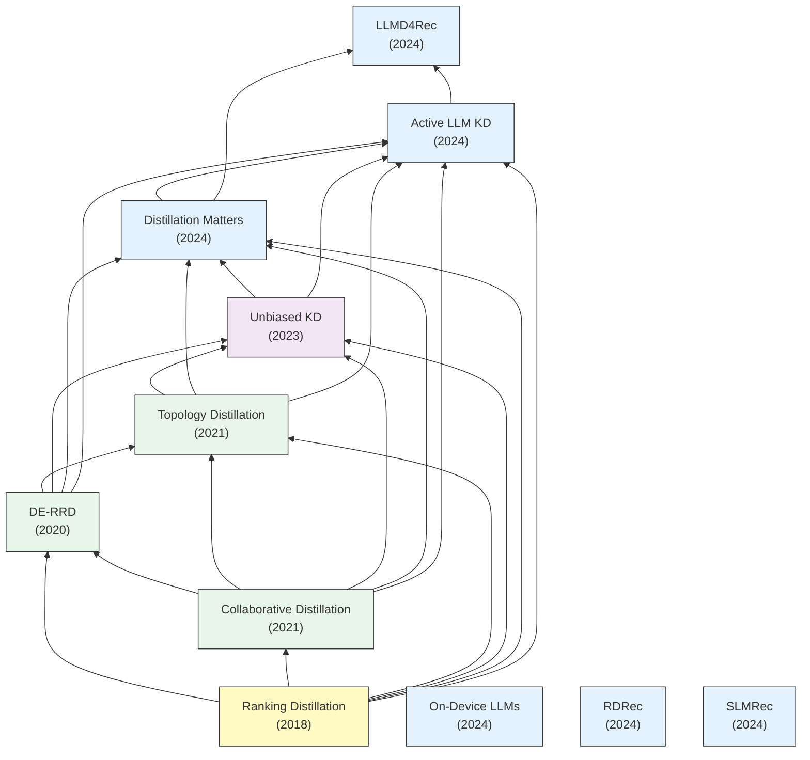

# LLMを用いたレコメンドモデルの蒸留技術

## 要約
近年、大規模言語モデル（LLM）の強力なセマンティック理解能力を推薦システム（RS）に導入する試みが盛んに行われている。しかし、数百万～数十億のユーザー行動をリアルタイムに処理する必要があるオンラインの推薦システムにおいて、LLMの膨大なパラメータ数による計算コストと推論遅延（レイテンシ）は実運用上の大きな障壁となっている。
これを解決するため「知識蒸留（Knowledge Distillation: KD）」技術が注目を集めている。これは、高精度だが巨大なLLM（教師モデル）が抽出したユーザーの意図や嗜好ランキング、アイテム背後の暗黙的関係を、軽量・高速な従来型推薦モデルや小規模な言語モデル（生徒モデル）へと転移させるアプローチである。
本まとめでは、ランキング問題に蒸留を適用する初期の試み（Ranking Distillation）を出発点とし、推論の根拠（Rationale）の蒸留、双方向（相互）蒸留、ローカルデバイス上での効率的な推論へと発展した、LLMベースレコメンドモデルにおける蒸留技術の系譜と相互関係を総括する。

## 年表

※[CSVファイル](./timeline.csv) も合わせて生成しています。

| 論文名 | 提案モデル | 発表年 | 発表場所 | 概要 | リンク |
|---|---|---|---|---|---|
| Ranking Distillation: Learning Compact Ranking Models With High Performance for Recommender System | Ranking Distillation (RD) | 2018 | KDD | 推薦システムにおいては高精度なランキングと高速な推論が重要だが、既存のKDは主に分類問題向けであったため、ランキング問題にKDを適用する新しい手法を提案した。 | [Link](./article_summaries/ranking%20distillation:%20Learning%20compact%20ranking%20models%20with%20high%20performance%20for%20recommender%20system/summary.md) |
| DE-RRD: A Knowledge Distillation Framework for Recommender System | DE-RRD | 2020 | CIKM | 精度を維持しながら推論レイテンシを削減するために「知識蒸留（KD）」を導入。未観測アイテムを正例のように扱うPoint-wiseなアプローチからの脱却を図る。 | [Link](./article_summaries/DE-RRD:%20A%20Knowledge%20Distillation%20Framework%20for%20Recommender%20System/summary.md) |
| Collaborative Distillation for Top-N Recommendation | Collaborative Distillation (CD) | 2020 | KDD | 知識蒸留を推薦システムに適用する際の「正例のスパース性」「欠損データの曖昧さ」「ランキングの課題」を解決する、協調フィルタリング向けのCDを提案。 | [Link](./article_summaries/Collaborative%20Distillation%20for%20Top-N%20Recommendation/summary.md) |
| Topology Distillation for Recommender System | Topology Distillation (TD) | 2021 | KDD | エンティティ同士の関係性（Relations/Topology）ごと生徒モデルに転移させる新しい蒸留パラダイムを提案。 | [Link](./article_summaries/Topology%20Distillation%20for%20Recommender%20System/summary.md) |
| Unbiased Knowledge Distillation for Recommendation | Unbiased KD | 2023 | WSDM | 知識蒸留を推薦システムに適用すると、人気アイテムのスコアが過剰に強化される「人気度バイアス増幅」が発生する問題を提起し、これを軽減する手法を提案した。 | [Link](./article_summaries/Unbiased%20Knowledge%20Distillation%20for%20Recommendation/summary.md) |
| On-Device Large Language Models for Sequential Recommendation | On-Device LLM Distillation | 2024 | arXiv | ネットワーク遅延やプライバシー保護の観点からエッジデバイスでのLLM推論が求められており、デバイスへのLLMモデル蒸留と効率化フレームワークを提案。 | [Link](./article_summaries/On-Device%20Large%20Language%20Models%20for%20Sequential%20Recommendation/summary.md) |
| Distillation Matters: Empowering Sequential Recommenders to Match the Performance of Large Language Model | LLM2Seq Distillation | 2024 | arXiv | LLMベースの推薦は計算量が大きく、既存の蒸留戦略では適用が難しいため、LLMの知識を軽量なシーケンシャルモデルへ効果的に蒸留するアプローチを検討した。 | [Link](./article_summaries/Distillation%20Matters:%20Empowering%20Sequential%20Recommenders%20to%20Match%20the%20Performance%20of%20Large%20Language%20Model/summary.md) |
| LLMD4Rec: Mutual Distillation Framework | LLMD4Rec | 2024 | WWW | LLMと既存の従来型推薦モデルが互いに知識を蒸留し合う相互蒸留システム。LLMの意味的理解とCRMの協調フィルタリングの学習の長所を統合した。 | [Link](./article_summaries/LLMD4Rec:%20Mutual%20Distillation%20Framework/summary.md) |
| RDRec: Rationale Distillation for LLM-based Recommendation | RDRec | 2024 | WSDM | テキストレビューベースの暗黙の好みにノイズが混ざる問題を回避するため、LLMsからインタラクションの根拠（Rationale）のみを蒸留し軽量モデルへ転移させた。 | [Link](./article_summaries/RDRec/summary.md) |
| Active Large Language Model-based Knowledge Distillation for Session-based Recommendation | Active-LLM KD | 2024 | WWW | 高速な処理能力が要求されるSession-based Recommendationに対して、生徒モデルが能動的にLLMに問い合わせる能動的知識蒸留（Active KD）を提案した。 | [Link](./article_summaries/Active%20Large%20Language%20Model-based%20Knowledge%20Distillation%20for%20Session-based%20Recommendation/summary.md) |
| SLMRec: Distilling Large Language Models into Small for Sequential Recommendation | SLMRec | 2024 | SIGIR | LLMの深い層がシーケンシャル推薦において冗長であることを解明し、浅い層だけの小規模LLMへタスク特化の知識を直接蒸留するSLMRecを開発。 | [Link](./article_summaries/SLMRec:%20Distilling%20Large%20Language%20Models%20into%20Small%20for%20Sequential%20Recommendation/summary.md) |

## 引用関係
（各論文の `ref_article.md` 内での参照関係のネットワーク解析結果）

## 研究の発展  

### 蒸留の前提知識: 2つのコア・パラダイム
本領域の発展（系譜Aの中心となる文脈）を理解するための前提知識として、以下の2つの代表的な蒸留アプローチのベース概念とその数理的解釈を解説します。

#### 1. Ranking Distillation
教師モデルが予測した**推論スコアの順序（ランキング）**を生徒モデルに順位構造ごと模倣させるアプローチです。
論文『Ranking Distillation: Learning Compact Ranking Models...』において推薦システム向けに初めて定式化され、未観測アイテムの中から教師モデルが高く評価した上位 $K$ 件を「正例」とみなします。単にすべてを均等に学習するのではなく、教師の予測推論順位 $r_{i}$ が高いほど重みを重くしたPoint-wiseの損失関数で知識転移を行いました。

$$ \mathcal{L}_{RD} = - \sum_{u \in U} \sum_{i \in I_{u}^{K}} w_{r_{i}} \cdot \log(\sigma(\hat{y}_{u,i})) $$

（※ $w_{r_{i}} \propto e^{-r_{i} / \lambda}$ 等の重みを用い、下位に潜むノイズによる悪影響を防ぐ概念の確立）

#### 2. Embedding Distillation
推論結果の確率スコアだけでなく、巨大な教師モデルが獲得した**中間層の潜在表現（Embeddingベクトル空間）**を生徒モデルに射影させ、表現空間（意味的構造）ごと模倣させるアプローチです。
論文『DE-RRD: A Knowledge Distillation Framework...』で提唱された Distilled Experts (DE) 手法では、次元圧縮された生徒のベクトル $h_{s}(u)$ に対し、複数のエキスパート関数 $E_{m}$ と選択ルーティング確率 $\alpha_{m}^{u}$ を用いて教師の次元へ動的にマッピングさせ、そのL2誤差を最小化させました。

$$ \mathcal{L}_{DE}(u) = \left\| h_{t}(u) - \sum_{m=1}^{M} \alpha_{m}^{u} \cdot E_{m}(h_{s}(u)) \right\|_{2}^{2} $$

（巨大な教師モデルの持つ豊かな意味論的トポロジーを、軽量な生徒モデルへ直接転移する概念の確立）

---

### 1. 【メインストリームの系譜】 推薦モデル蒸留から相互蒸留への発展 (系譜A)
現在の本流とも言えるこの系譜は、以下の4つのフェーズを経て発展してきました。

- **① 第1世代: 初期のランキング蒸留（2018〜2020年）**
  推薦システムにおける知識蒸留は、**Ranking Distillation (2018)** から本格化しました。しかし、これは分類問題のロジックを無理やりランキングに適用したPoint-wiseなアプローチであり限界がありました。その後、未観測データの扱い方を洗練させ、ソフトラベルにランクリニアな重みを乗せて蒸留を行う **DE-RRD (2020)** や **Collaborative Distillation (2020)** が登場し、トップN推薦の精度が飛躍的に向上しました。

- **② 第2世代: トポロジーとバイアスの克服（2021〜2023年）**
  個別にアイテムのembeddingを真似るのではなく、**Topology Distillation (2021)** のように「ユーザー同士・アイテム同士の相対的な距離（トポロジー）」を直接蒸留する新しいアプローチが生まれました。加えて、この時期の蒸留には特有の「人気度バイアスの増幅問題」が潜んでいることが解明され、**Unbiased KD (2023)** においてKDの弱点であったマイナーアイテムへの推薦精度を補正する技術へと深化しました。

- **③ 第3世代: LLMの導入とパラダイムシフト（2024年初頭）**
  2023年以降LLMが推薦タスクでSOTAを記録し始めると、推論遅延を解消しつつLLMを使うため「**高セマンティックなLLM知識の蒸留**」へとパラダイムが急速に移行しました（**Distillation Matters**等）。また蒸留の品質とコスト（推論API予算等）を最適化するため、全データに重み付けを行う手法から、**Active LLM KD (2024)**のように「LLMに推論させる学習サンプルそのものを数百件に厳選する（Active Learning）」手法も生まれ、蒸留すべきデータの重み付け、選定手法が研究されました。

- **④ 第4世代: 双方向・相互蒸留への到達（最新のメインストリーム）**
  ついに**LLMD4Rec (2024)** において、LLMが持つ「意味的な理解」と従来モデル（CRM）が持つ「長年の協調フィルタリング知識」を互いに対等に教え合う「双方向・相互蒸留 (Mutual Distillation)」の概念へと到達しました。一方向の知識転移という壁を打ち破り、両モデルが反復的に精度を底上げし合う現在の強力な主流フレームワークとして君臨しています。

#### 系譜Aにおける各モデルの蒸留パラダイム分類表
この系譜における進化は、主に「予測スコア（**ランキング蒸留**）」「潜在表現（**Embedding蒸留**）」という2つの手法の枠組みと、LLM時代に向けて最も重要視されるようになった「**蒸留サンプルの重みや選定（抽出戦略）**」の進展の歴史として整理することができます。

| 論文名 | モデル名 | 世代 | 蒸留元 (Teacher) | 蒸留先 (Student) | ランキング(Ranking)蒸留の系譜と進展 | Embedding蒸留の系譜と進展 | 蒸留サンプルの重みや選定 (Sample Selection) |
|---|---|---|---|---|---|---|---|
| Ranking Distillation: Learning Compact Ranking Models... | RD | 第1世代 | 大規模推薦モデル (CF / GNN) | 軽量推論モデル | **○【原点】** 未観測の上位K件アイテムを強引に正例(1)と見なして確率スコアを学習させる初期アプローチ（Point-wise）。 | **×** (不使用) | **【固定Top-Kと順位減衰】** 上位K件を固定で対象としつつ、順位が下がるほど確信度が低いとして減衰させる位置ベースの重み（Position-aware）を導入。 |
| DE-RRD: A Knowledge Distillation Framework... | DE-RRD | 第1世代 | 大規模推薦モデル (CF / GNN) | 軽量推論モデル | **○【初のSoft-label導入】** RDのハードラベルの限界を克服。上位の相対順位を維持しつつ下位を引き下げる初のソフト制約（List-wise）へと進化。 | **○【初の表現転移】** 推薦システムにおいて初めて中間層の潜在知識（Embedding）をターゲットとし、専用エキスパートで直接マッピング転移。 | **【Top-Kと無作為下位の対比】** 順位を守らせる上位K件を対象としつつ、下位からL件を「ランダムに抽出」して下位への引き下げ（Relaxed）に用いるアプローチ。 |
| Collaborative Distillation for Top-N Recommendation | CD | 第1世代 | 大規模推薦モデル (CF / GNN) | 軽量推論モデル | **○【RDからの進展】** DE-RRDと同時期にソフトターゲットを定式化。リスト全体から未観測アイテムを順序構造ごと模倣。 | **×** (不使用: ランキング構造抽出に特化) | **【確率的・動的なサンプリング】** 固定Top-Kを捨て、順位に応じた確率的サンプリングを実施。生徒自身の推測に基づく動的抽出(Student-guided)も提唱。 |
| Topology Distillation for Recommender System | TD | 第2世代 | 大規模推薦モデル (CF / GNN) | 軽量推論モデル | **×** (推論順位自体は対象としない) | **○【関係性グラフへの進化】** 点ベクトルをマッピングする手法から脱却し、Embedding空間内の「相対的な距離のグラフ構造（Topology）」ごと丸ごと模倣。 | **【空間トポロジーの形成アンカー抽出】** 個別のユーザー行動ではなく、関係性グラフを形成するための「アンカーポイント（基準点）」を中心に抽出。 |
| Unbiased Knowledge Distillation for Recommendation | Unbiased KD | 第2世代 | 人気度バイアス除去済のベースモデル | 軽量推論モデル | **○【課題解決】** 初期ランキング蒸留が抱えていた「人気度バイアスの激しい増幅」の欠陥を定式化し、数理的に除去・補正して出力分布を蒸留。 | **×** (不使用: 分布のバイアス除去に特化) | **【人気度階層での層別サンプリング】** 全体をK個の人気度層に分割し、**「同じ人気度を持つ層の内側だけで正負ペアをサンプリング」**することで、因果的バイアスの干渉を構造的に相殺する。 |
| Distillation Matters: Empowering Sequential Recommenders... | DLLM2Rec | 第3世代 | 大規模言語モデル (LLM) | 軽量系列モデル (SASRec等) | **○【LLM特有のRank蒸留】** LLMのハルシネーション対策として、推論位置に加え**「教師が自信を持っているか(確信度)」**と**「生徒が無理なく学習可能か(両者の一致度)」**を評価し、ノイズを除外する重み付きランキング蒸留。 | **○【LLMのEmbedding同期】** 「巨大なLLMが持つ重厚な意味論ベクトル」を、アーキテクチャの異なる軽量モデルの次元に強力に同期（アラインメント）する。 | **【自信度と学習可能性による重み付け】** LLMの推論結果全件に対し、単なる順位だけでなく「教師の確信度(Confidence)」と「生徒の学習可能性・一致度(Consistency)」で厳密に重み付けし、無効・有害な知識をフィルタリングする。 |
| Active Large Language Model-based Knowledge Distillation... | ALKDRec | 第3世代 | 大規模言語モデル (LLM等) | 軽量推論モデル | **○【Pair-wise蒸留への回帰】** LLMが上位予測したアイテムリストと、下位アイテムリストの差分を最適化するPair-wise Lossを用いたランキング蒸留。 | **×** (不使用: 厳選されたサンプルの出力結果（ランキングとルール推論群）のみに依存) | **【ヒューリスティックとゲーム理論によるサンプル抽出】** 生徒の難易度(Difficulty)と「LLMが正解/誤答する比率」のヒューリスティックな仮定を組み合わせ、**ゲーム理論（最悪想定を最大化するMax-Minゲーム）によって抽出確率を計算**。真に学習価値のある数百件のみを狙い撃ちし、事後の「重み付け」から事前の「厳選サンプリング」へとパラダイムを進めた。 |
| Bidirectional Knowledge Distillation for Enhancing... | LLMD4Rec | 第4世代 | LLM ⇄ CRM (互いに兼任) | LLM ⇄ CRM (互いに兼任) | **○【最終到達点】** 歴代手法の一方向の知識転移の壁を破り、「全候補への推論確率分布全体」を **双方向** でKL最適化。反復的に精度を底上げする現在のメインストリーム。 | **×【あえての完全排除】** 次元間の無理なEmbeddingマッピングによる「カンニング（ショートカット学習）」を防ぐため、中間表現転移を意図的に完全に切り捨てた。 | **×【不使用（サンプリング・重み付けの完全撤廃）】** 限定的なサンプルの抽出や、後段でのヒューリスティックな重み付け等を行わず、候補となる「全アイテムの推論確率分布（ロジット）全体」をいじらずに双方向で直接同期（KLダイバージェンス）させるアプローチへの回帰。 |

---

### 2. 【独立したもうひとつの系譜】 NLP・LLM圧縮技術からの派生 (系譜B)
一方で、前述のメインストリーム（系譜A）とは異なる独自の視点で進化を歩んできたのが、**SLMRec (2024)** や **On-Device LLMs (2024)** といった研究群です。
これらは従来の推論モデルへスコアを渡す「推薦タスクの蒸留」ではなく、「巨大なLLM自体を推薦システムにいかに軽量に組み込むか（圧縮するか）」や「LLMの自然言語推論プロセス自体をどう蒸留するか」という、全く別のアプローチをルーツとしています。

- **SLMRec (2024)**: クラウド上の超巨大なLLMを蒸留元とし、スマートフォン上で動くような軽量なSLM（Small Language Model）へと、段階的なプロンプトを用いて推薦知識を転移（Step-by-step distillation）させるモデル圧縮技術。
- **On-Device Large Language Models for Sequential Recommendation (2024)**: モデルのプルーニングや量子化（Quantization）技術と組み合わせて、性能劣化を防ぎながらハードウェア制約の厳しい端末上でのリアルタイム推論速度を極限まで高めるシステムアーキテクチャ指向の研究。
- **RDRec: Rationale Distillation for LLM-based Recommendation (2024)**: 単純な推論スコアや確率分布（ロジット）を転移するのではなく、LLMが自然言語として生成した「なぜそのアイテムを推奨するのか」という論理的理由付け（**Rationale / 推論根拠**）テキスト自体をターゲットとして抽出・転移を行う、テキストベースの推論プロセス蒸留の新機軸。

## 考察と今後の発展課題

本調査を通して、推薦システムにおける知識蒸留技術（特にLLM導入の前後）の系譜と進化が明確になりました。この歴史的変遷を踏まえ、今後の研究領域における重要なホワイトスペース（未解決課題）として以下の3点が考察されます。

### 1. LLMに特化したトポロジー蒸留の不在
初期の知識蒸留において、単純な推論ベクトルを個別に転移させることから脱却し、ベクトル空間内におけるユーザーやアイテムの関係性を丸ごと模倣する「トポロジーを用いたEmbedding蒸留（Topology Distillationなど）」の手法は存在し、効果を上げていました。しかし、現時点で「巨大なLLMが持つ重厚な意味論的トポロジー（概念構造のグラフ）」を、軽量な推薦モデルへ転移することに特化して定式化された研究はまだ見当たりません。LLMの複雑な潜在空間の構造的関係性を維持したまま転移できれば、単なる特徴量アラインメント以上の飛躍的な性能向上が見込める可能性があります。

### 2. 「サンプリング抽出戦略」と「相互蒸留」の未統合
第3世代において、LLMのハルシネーションを排除し学習効率を高めるための「サンプリングの重み付け（DLLM2Rec）」や「アクティブラーニングによる抽出サンプルの厳選（Active-LLM KD）」という、抽出のパラダイムシフトが起こりました。一方で、最新世代である「双方向の相互蒸留（LLMD4Recなど）」のアプローチでは、全確率分布の同期をまるごと優先する構造上、これらの高度化されたサンプリング技術と上手く統合されておらず、結果的に手放している状態です。「相互に教え合いながらも、学習させるサンプルを生徒の難易度や推論の確信度に応じて動的に厳選する」というアプローチの統合が、次世代のボトルネックを打ち破る鍵となり得ます。

### 3. ヒューリスティックに依存するアクティブラーニングの改善余地
APIコストを激減させつつ精度向上を達成したActive-LLM KD（アクティブラーニング）のアプローチは非常に強力でした。しかし、その抽出ロジックの根幹となる「生徒にとっての難易度の定義」や、「事前推論に対する正当率の仮定（1:5:4の比率）」などは、ドメインや状況に依存するヒューリスティック（経験則）に過度に頼ったままゲーム理論を展開しています。事前学習モデルのLossの減衰具合などから、サンプル抽出の比率設定や抽出ペナルティをより動的に適応（あるいは学習）させる仕組みが開発されれば、推薦システムにおけるアクティブラーニング蒸留にはまだまだ大きな改善と発展の余地が残されています。
