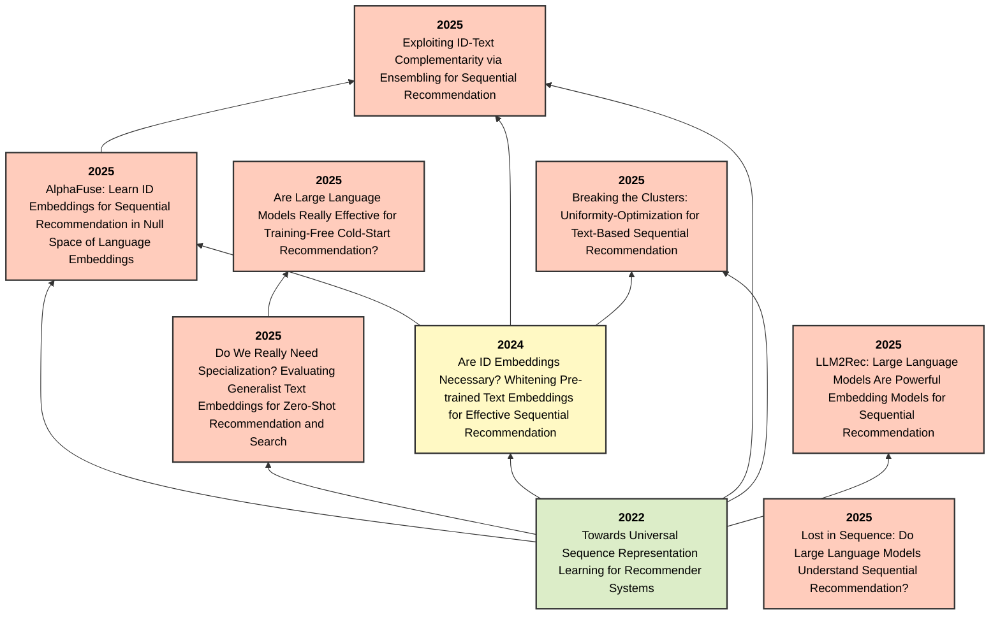

# LLM埋め込みを用いたレコメンド

## 要約
本テーマは、大規模言語モデル (LLM) や事前学習済みテキストエンコーダ（BERT等）から得られるテキスト埋め込みを、レコメンドタスク（逐次推薦やコールドスタート推薦など）にどのように活用・最適化するかを探求する一連の研究である。
初期のUniSRec等が汎用的な表現学習を提案して以降、WhitenRecのような「埋め込みの白色化（異方性解消）」による最適化や、ID埋め込みとの補完的なアンサンブル（EnsRec）、さらにはLLMの埋め込み空間を「そのまま」用いるアプローチ（Training-freeやGeneralist Embeddings）の限界と可能性が検証されてきました。また、LLMが順序情報をそもそも理解しているか（Lost in Sequence）という本質的な問いかけに対する検証も行われ、現在では各課題に対する専用の蒸留手法や分布最適化アプローチが提案されています。

## 年表
| 論文名 | 提案モデル | 発表年 | 発表場所 | 概要 | リンク |
|---|---|---|---|---|---|
| Towards Universal Sequence Representation Learning for Recommender Systems | UniSRec（Universal Sequence Representation Learning） | 2022 | KDD | **問題視**: IDベースのモデルでは新規ドメインへの知識転移ができずコールドスタート問題が深刻であり、かといって生のテキストを使うだけでは異方性などの弊害があった。 **手法**: テキストをセマンティックブリッジとし、Parametric WhiteningとMoEを用いた「UniSRec」を提案。 **解決**: 複数ドメイン間で共有可能なアイテムの汎用的シーケンス表現を獲得し、未知ドメインに対するゼロショット推薦を可能にした。 | [詳細](./article_summaries/Towards%20Universal%20Sequence%20Representation%20Learning%20for%20Recommender%20Systems/summary.md) |
| Are ID Embeddings Necessary? Whitening Pre-trained Text Embeddings for Effective Sequential Recommendation | WhitenRec | 2024 | arXiv | **問題視**: IDを用いないテキスト単体での推薦は、事前学習済み埋め込みの「極端な異方性（表現の退化）」によりアイテムが識別できず精度が低かった。 **手法**: ZCAを用いた「完全な白色化」と意味を保持する「緩和された白色化」を統合したアーキテクチャ「WhitenRec」を提案。 **解決**: 表現を平滑化して区別能力を飛躍的に高めつつセマンティクスを維持し、未知アイテムへの驚異的な推論性能（Cold-startの大幅な改善）を実現した。 | [詳細](./article_summaries/Are%20ID%20Embeddings%20Necessary%3F%20Whitening%20Pre-trained%20Text%20Embeddings%20for%20Effective%20Sequential%20Recommendation/summary.md) |
| AlphaFuse: Learn ID Embeddings for Sequential Recommendation in Null Space of Language Embeddings | 記載なし | 2025 | arXiv | **問題視**: LLMの言語埋め込みとアイテムIDの埋め込みを統合しようとする従来手法では、次元削減で豊かな知識が退化したり、パラメータ増大による効率低下が起こっていた。 **手法**: 言語埋め込みの「零空間（Null Space）」を利用し、元の言語情報と直交する空間にIDの行動パターンを埋め込むSVDを用いたアプローチを提案。 **解決**: LLMが持つ豊かな世界知識を一切破壊することなく歴史的な行動パターンを統合することに成功し、推薦精度と推論効率を完全に両立させた。 | [詳細](./article_summaries/AlphaFuse%3A%20Learn%20ID%20Embeddings%20for%20Sequential%20Recommendation%20in%20Null%20Space%20of%20Language%20Embeddings/summary.md) |
| Breaking the Clusters: Uniformity-Optimization for Text-Based Sequential Recommendation | 記載なし | 2025 | arXiv | **問題視**: テキストベースの推薦では、シーケンス履歴内で似た意味のアイテムが特徴空間上で過度に密集（クラスタリング）してしまい識別が困難になっていた。 **手法**: テキスト埋め込みの表現が空間上にどれだけ均一に散らばっているか（Uniformity）を最適化し、密集を解きほぐすフレームワーク「UniT」を提案。 **解決**: 特徴空間での識別能を強制的に引き上げたことで、ロングテールなアイテム群やコールドスタートシナリオにおける推論精度を大幅に向上させた。 | [詳細](./article_summaries/Breaking%20the%20Clusters%3A%20Uniformity-Optimization%20for%20Text-Based%20Sequential%20Recommendation/summary.md) |
| Do We Really Need Specialization? Evaluating Generalist Text Embeddings for Zero-Shot Recommendation and Search | 記載なし | 2025 | arXiv | **問題視**: 推薦・検索タスクでは専用のファインチューニングが必須と信じられてきたが、特化型学習は計算・運用コストが高くつく問題があった。 **手法**: 追加学習を一切行わず、汎用テキスト埋め込みモデル（GTEs）をそのまま「ゼロショット」で使用する徹底的なパフォーマンステストを実施。 **解決**: 言語モデルが十分に優れていれば、GTEsは最適化なしでも特化型モデル以上の精度を発揮することを実証し、高コストな学習プロセスの不要論を導き出した。 | [詳細](./article_summaries/Do%20We%20Really%20Need%20Specialization%3F%20Evaluating%20Generalist%20Text%20Embeddings%20for%20Zero-Shot%20Recommendation%20and%20Search/summary.md) |
| Are Large Language Models Really Effective for Training-Free Cold-Start Recommendation? | 記載なし | 2025 | arXiv | **問題視**: 学習データが存在しない環境下（Cold-Start）では、LLMを用いてテキストから直接ランキングを行う推論が最強の手法だと盲信されていた。 **手法**: テキストのセマンティックマッチングのみを行う単純な「テキスト埋め込みモデル（TEM）」とLLMリランカーの推論結果を公平かつ厳密に比較検証した。 **解決**: 重い推論コストを伴うLLMをわざわざ使わなくても、単純なTEMを用いたコサイン類似度検索がLLMの性能を大きく上回ることを立証し、手法の過信に警鐘を鳴らした。 | [詳細](./article_summaries/Are%20Large%20Language%20Models%20Really%20Effective%20for%20Training-Free%20Cold-Start%20Recommendation%3F/summary.md) |
| Exploiting ID-Text Complementarity via Ensembling for Sequential Recommendation | EnsRec | 2025 | arXiv | **問題視**: 初見に強いテキスト表現と履歴に強いID表現を統合する既存アプローチは、多段階学習や複雑なアーキテクチャにより最適化が困難だった。 **手法**: 両者が「協調フィルタリングの行動パターン」と「セマンティックな意味」という異なる相補的シグナルを学習している特性を活かし、結果を直接結合する「EnsRec」を提案。 **解決**: 複雑な訓練をすべて撤廃し、モデルをシンプルにアンサンブルさせるだけで最高水準の性能を引き出し、実用的な解を示した。 | [詳細](./article_summaries/Exploiting%20ID-Text%20Complementarity%20via%20Ensembling%20for%20Sequential%20Recommendation/summary.md) |
| LLM2Rec: Large Language Models Are Powerful Embedding Models for Sequential Recommendation | 記載なし | 2025 | arXiv | **問題視**: LLMはセマンティクスの理解には優れるが「行動の共起性（CFシグナル）」を捉えられず、これを従来手法で強引に融合させると膨大な計算コストがかかっていた。 **手法**: LLMに対し、購買履歴予測（CSFT）と双方向のアイテム対照学習（IEM）を行い、LLMを直接推薦専用エンコーダに改修する「LLM2Rec」を提案。 **解決**: LLMの高度な理解力を保ったままCFシグナルを低コスト・シームレスに表現空間へ統合し、未知ドメインに対する比類なき汎化性能を実現した。 | [詳細](./article_summaries/LLM2Rec%3A%20Large%20Language%20Models%20Are%20Powerful%20Embedding%20Models%20for%20Sequential%20Recommendation/summary.md) |
| Lost in Sequence: Do Large Language Models Understand Sequential Recommendation? | LLM-SRec | 2025 | arXiv | **問題視**: LLMを推薦に用いる研究において、「LLMがユーザー履歴の『順序性』を本当に理解できているのか？」という検証が欠落しており、実は表面的な単語の羅列と区別できていなかった。 **手法**: LLMのパラメータは直接いじらず、純粋な「系列知識」のみを専用のCFモデルからLLMへ抽出・移植（蒸留）する軽量なフレームワーク「LLM-SRec」を提案。 **解決**: LLMに欠落していた真のシーケンス理解能力を明示的に付与し、非常に少ない計算負荷で他を凌駕する強力な推薦精度を達成した。 | [詳細](./article_summaries/Lost%20in%20Sequence%3A%20Do%20Large%20Language%20Models%20Understand%20Sequential%20Recommendation%3F/summary.md) |

## 引用関係

## 研究の相互関係
1. **基礎となる表現学習**: UniSRec (2022) が多様なドメインにまたがる汎用的なシーケンス表現学習の基礎を築きました。
2. **埋め込み空間の性質と問題の顕在化**: WhitenRec (2024) は、事前学習済み埋め込みが持つ「異方性（偏在）」に起因するRepresentation Degeneration（表現の退化）問題を指摘し、白色化変換という解決策を提示しました。
3. **Training-FreeおよびZero-Shotへの挑戦 (2025)**: LLMの表現能力が高まるにつれ、特別な学習を伴わない「Are Large Language Models Really Effective for Training-Free Cold-Start Recommendation?」や汎用埋め込み（GTEs）を探求する「Do We Really Need Specialization?」が登場しました。
4. **本質的な弱点と解決策の発展 (2025-)**: 「Lost in Sequence」はLLMが本質的な時系列情報の理解を欠いていることを示し、蒸留（Distillation）を提案しました。「AlphaFuse」「Breaking the Clusters」「LLM2Rec」「Exploiting ID-Text Complementarity」などは、それぞれID埋め込みとの共存手法や分布最適化を通して、テキストベース推薦システムの理論的限界を次々と打破しています。
